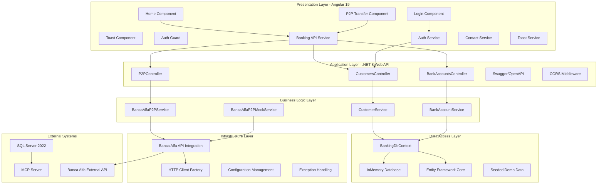
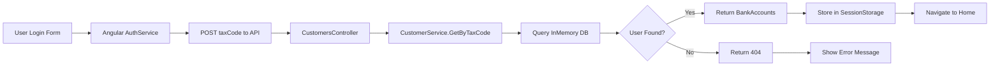
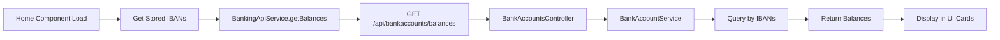
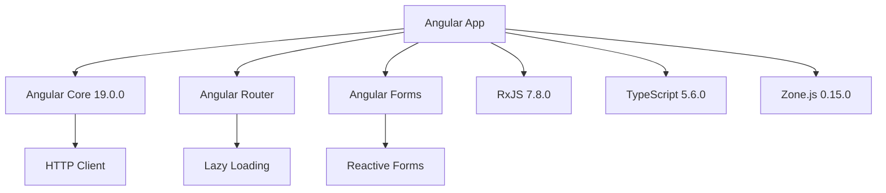
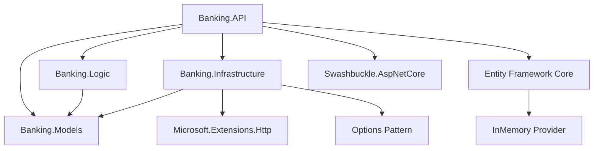
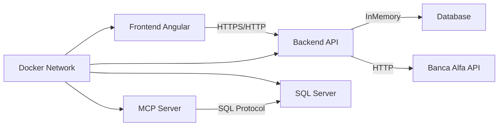

# Architectural Blueprint - Banking FSI Demo Solution Analysis

## Metadati del Documento
- **Data Analisi**: 2025-09-15
- **Tipo Solution**: Microservizi con architettura containerizzata
- **Tecnologie Principali**: .NET 8, Angular 19, Docker, SQL Server 2022
- **Pattern Architetturali**: Clean Architecture, Repository Pattern, Dependency Injection, Service Layer Pattern

## Overview della Solution
La solution analizzata è un'applicazione bancaria demo per il settore Financial Services Industry (FSI) che implementa funzionalità di home banking con trasferimenti P2P (peer-to-peer). La solution utilizza un'architettura a microservizi con frontend Angular e backend .NET, orchestrata tramite Docker Compose.

### Struttura Progetti Identificata
- **Frontend**: `fe/` - Applicazione Angular 19 standalone
- **Backend**: `be/` - Solution .NET 8 con 4 progetti
  - `Banking.API` - Web API Controllers
  - `Banking.Logic` - Business Logic Services
  - `Banking.Models` - Entities, DTOs, DbContext
  - `Banking.Infrastructure` - External API Integration (Banca Alfa)
- **Tests**: `e2e_fe_test/` - Test E2E con Puppeteer
- **Infrastructure**: Docker, docker-compose, MCP Server per SQL

## Architettura Funzionale

### Diagramma Layered Architecture

### Componenti per Layer

#### Presentation Layer (Angular 19)
- **Componenti identificati**:
  - `AppComponent` - Root component
  - `LoginComponent` - Autenticazione con Tax Code
  - `HomeComponent` - Dashboard con saldi conti
  - `P2PTransferComponent` - Trasferimenti P2P
  - `ToastComponent` - Notifiche UI
- **Servizi Angular**:
  - `BankingApiService` - HTTP client per backend API
  - `AuthService` - Gestione autenticazione e sessione
  - `ContactService` - Gestione contatti e preferiti
  - `ToastService` - Sistema notifiche toast
  - `ConfigService` - Configurazione API URL
- **Routing**: Lazy loading con route guards
- **Guards**: `AuthGuard` per protezione route

#### Application Layer (.NET 8 Web API)
- **Controller identificati**:
  - `CustomersController` - Gestione clienti e autenticazione
  - `BankAccountsController` - Gestione conti bancari e saldi
  - `P2PController` - Trasferimenti P2P con validazione
- **Middleware**:
  - CORS configuration per frontend
  - HTTPS redirection (production)
  - Swagger/OpenAPI documentation
- **DTOs**: Customer, BankAccount, Balance, P2PTransferRequest/Response

#### Business Logic Layer
- **Services identificati**:
  - `CustomerService` (ICustomerService) - Logica clienti
  - `BankAccountService` (IBankAccountService) - Logica conti
  - `BancaAlfaP2PService` (IBancaAlfaP2PService) - Integrazione P2P reale
  - `BancaAlfaP2PMockService` - Mock service per sviluppo
- **Pattern**: Service Layer con interfacce per DI

#### Data Access Layer
- **DbContext**: `BankingDbContext` con Entity Framework Core
- **Database**: InMemory Database per sviluppo
- **Entities identificate**:
  - `Customer` - Clienti bancari
  - `BankAccount` - Conti bancari
- **Seed Data**: 2 clienti demo con 3 conti totali
  - Mario Rossi (RSSMRA80A01H501Z) - 2 conti
  - Giulia Bianchi (BNCGLI85M15F205W) - 1 conto

#### Infrastructure Layer
- **External API Integration**: Banca Alfa P2P Service
- **Configuration**: `BancaAlfaApiConfiguration` con Options pattern
- **HTTP Client**: Named HttpClient con factory pattern
- **Exception Handling**: Custom exceptions (ValidationException, BusinessLogicException, SystemException)
- **Mocking**: Configurabile via appsettings

## Flussi Operativi

### Flusso di Autenticazione

### Flusso P2P Transfer

```mermaid
flowchart LR
    A[P2P Transfer Form] --> B[Select Recipient]
    B --> C[Enter Amount]
    C --> D[Add Description]
    D --> E[Submit Transfer]
    E --> F[Angular BankingApiService]
    F --> G[POST to P2PController]
    G --> H[Validate Request]
    H --> I{Mock Enabled?}
    I -->|Yes| J[BancaAlfaP2PMockService]
    I -->|No| K[BancaAlfaP2PService]
    J --> L[Generate Mock Response]
    K --> M[Call External API]
    L --> N[Return TransactionId]
    M --> N
    N --> O[Update UI with Toast]
    O --> P[Navigate to Home]
```

### Flusso Balance Query

## Dipendenze Applicative

### Dipendenze Frontend (Angular 19)

### Dipendenze Backend (.NET 8)

### Comunicazione Inter-Service

## Pattern e Tecnologie Identificate

### Pattern Architetturali
- **Clean Architecture**: Separazione in progetti distinti (API, Logic, Models, Infrastructure)
- **Repository Pattern**: Implementato implicitamente tramite DbContext e service layer
- **Dependency Injection**: Constructor injection con registrazione in Program.cs
- **Service Layer Pattern**: Business logic isolata in servizi con interfacce
- **Options Pattern**: Configurazione tipizzata con IOptions<T>
- **Factory Pattern**: HTTP Client Factory per gestione connessioni
- **Mock Pattern**: Servizi mock configurabili per testing

### Framework e Librerie

#### Frontend
- **Angular**: v19.0.0 con standalone components
- **TypeScript**: v5.6.0
- **RxJS**: v7.8.0 per programmazione reattiva
- **Angular DevKit**: v19.0.0 per build tools
- **Karma/Jasmine**: Testing framework

#### Backend
- **.NET**: 8.0 (target framework net8.0)
- **Entity Framework Core**: Con InMemory provider
- **Swashbuckle**: Swagger/OpenAPI documentation
- **Microsoft.Extensions.Http**: HTTP Client Factory
- **Microsoft.Extensions.Options**: Configuration binding

### Configurazioni Deployment
- **Docker Backend**: Multi-stage build con .NET SDK e runtime
- **Docker Frontend**: Multi-stage con Node.js build e nginx serve
- **docker-compose**: Orchestrazione 5 servizi:
  - `banking-api`: Backend su porte 7086 (HTTPS) e 5000 (HTTP)
  - `banking-frontend`: Frontend su porta 4200
  - `cert-extractor`: Utility per certificati SSL
  - `sqlserver`: SQL Server 2022 Express su porta 1433
  - `mssql-mcp-server`: MCP server per AI database operations
- **Volumes**: 
  - `app-data`: Persistenza backend
  - `sqlserver-data`: Persistenza database
- **Network**: `banking-network` bridge driver
- **Health Checks**: Configurati per tutti i servizi

## Database e Storage
- **Database Type**: InMemory Database (sviluppo), SQL Server 2022 (testing)
- **ORM**: Entity Framework Core con Code First
- **Connection String**: Configurabile via appsettings
- **Entities mappate**:
  - `Customer`: Id, FirstName, LastName, TaxCode, Email, Phone, CreatedDate, IsActive
  - `BankAccount`: Id, Iban, AccountName, AccountType, Balance, OpenDate, LastUpdated, IsActive, CustomerId
- **Relazioni**: One-to-Many (Customer -> BankAccounts) con cascade delete

## API e Comunicazione

### REST Endpoints identificati
- **Customers**:
  - `GET /api/customers` - Lista clienti
  - `GET /api/customers/{id}` - Dettaglio cliente
  - `GET /api/customers/{id}/bank-accounts` - Conti del cliente
  - `GET /api/customers/taxcode/{taxCode}/bank-accounts` - Login con Tax Code
- **Bank Accounts**:
  - `GET /api/bankaccounts` - Lista conti
  - `GET /api/bankaccounts/{id}` - Dettaglio conto
  - `GET /api/bankaccounts/iban/{iban}/balance` - Saldo per IBAN
  - `GET /api/bankaccounts/balances?ibans={list}` - Saldi multipli
- **P2P**:
  - `POST /api/P2P/transfer` - Esegui trasferimento
  - `POST /api/P2P/validate` - Valida richiesta
  - `GET /api/P2P/health` - Health check servizio

### Authentication
- **Tipo**: Tax Code based authentication (no JWT)
- **Storage**: SessionStorage per dati utente e conti
- **Guard**: AuthGuard per protezione route Angular

### API Documentation
- **Swagger**: Abilitato in Development e Production
- **Route**: `/swagger`
- **ProducesResponseType**: Attributi per documentazione response

## File di Configurazione Analizzati
- **Frontend**: 
  - `package.json` - Dipendenze npm
  - `angular.json` - Configurazione Angular build
  - `tsconfig.json` - Configurazione TypeScript
- **Backend**: 
  - `*.csproj` - Progetti .NET con dipendenze NuGet
  - `appsettings.json` - Configurazione base
  - `appsettings.Development.json` - Override sviluppo
  - `appsettings.Docker.json` - Override Docker
  - `launchSettings.json` - Profili di lancio
- **Deployment**: 
  - `Dockerfile` (be/ e fe/) - Build images
  - `docker-compose.yml` - Orchestrazione servizi
  - `start-docker.ps1` - Script automazione PowerShell
- **Database**: 
  - Connection string in appsettings
  - InMemory database configuration in Program.cs

## Configurazioni Speciali

### MCP Server Configuration
Il progetto include un MCP (Model Context Protocol) server per operazioni database AI-driven:
- Immagine: `aadversteeg/mssqlclient-mcp-server:latest`
- Modalità: Server mode per operazioni multi-database
- Capabilities: Execute queries, stored procedures
- Connection: SQL Server su porta 1433

### HTTPS Configuration
- Certificati self-signed generati automaticamente
- Storage in volume persistente `/persistence/certs`
- Password protected PFX files
- Kestrel configuration per HTTPS binding

### Environment Variables
- `ASPNETCORE_ENVIRONMENT`: Development/Production
- `ASPNETCORE_URLS`: HTTP e HTTPS endpoints
- `API_URL`: Backend URL per frontend
- `SA_PASSWORD`: SQL Server admin password
- `MSSQL_CONNECTIONSTRING`: Connection per MCP server

---
*Questo blueprint è basato esclusivamente sull'analisi del codice fornito nel workspace.*