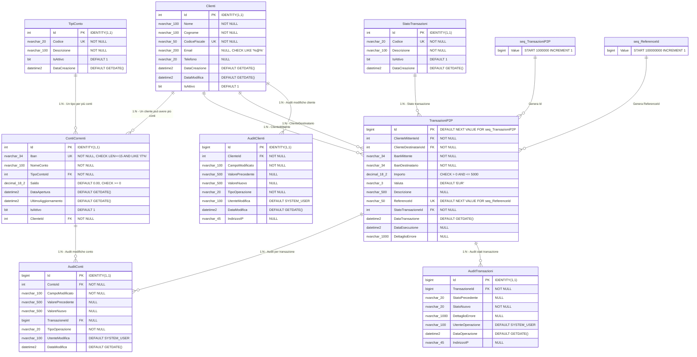

# Database Modification Specification

## Data Creazione
15 Settembre 2025

## Analisi del Codice Sorgente

### Entità Identificate Automaticamente
Dal codice .NET e Angular sono state identificate le seguenti entità principali:

#### 1. Customer (Cliente)
- **Ubicazione**: `Banking.Models.Entities.Customer`
- **Campi**: Id, FirstName, LastName, TaxCode, Email, Phone, CreatedDate, IsActive
- **Caratteristiche chiave**: 
  - TaxCode univoco utilizzato per autenticazione
  - Soft delete tramite campo IsActive
  - Relazione 1:N con BankAccount

#### 2. BankAccount (Conto Corrente)
- **Ubicazione**: `Banking.Models.Entities.BankAccount`
- **Campi**: Id, Iban, AccountName, AccountType, Balance, OpenDate, LastUpdated, IsActive, CustomerId
- **Caratteristiche chiave**:
  - IBAN univoco
  - Balance con precisione decimal(18,2)
  - Tipi account: CHECKING, SAVINGS
  - Relazione N:1 con Customer

#### 3. P2P Operations (Operazioni P2P)
- **Ubicazione**: Frontend models `fe/src/app/models/p2p.model.ts`
- **Operazioni**: Transfer request/response, validation, error handling
- **Campi transazione**: sender_tax_id, recipient_tax_id, amount, currency, description, reference_id

### Architettura Attuale
- **Database corrente**: Entity Framework InMemoryDatabase
- **Pattern architetturale**: Clean Architecture
- **Autenticazione**: Lookup via TaxCode
- **Demo data**: Mario Rossi (RSSMRA80A01H501Z), Giulia Bianchi (BNCGLI85M15F205W)

## Requisiti di Business Raccolti

### Volume e Performance
- **Transazioni giornaliere**: ~1000 transazioni/giorno
- **Volume annuale stimato**: ~365.000 transazioni/anno
- **Storico**: Completo permanente (nessuna archiviazione)
- **Crescita prevista**: Schema deve supportare scaling futuro

### Audit e Compliance
- **Audit trail completo** richiesto per compliance bancaria:
  - Tutte le modifiche ai saldi dei conti
  - Modifiche ai dati dei clienti (nome, email, telefono, etc.)
  - Tentativi di transazione (successo/fallimento)
  - Tracciabilità: chi, quando, cosa, valori precedenti

### Pattern di Accesso Principali
1. **Verifica saldo per IBAN** (query più frequente)
2. **Ricerca transazioni cliente per periodo** (ultimi 30/90 giorni)
3. **Report giornalieri/mensili** di tutte le transazioni

## Schema Proposto

### Diagramma delle Relazioni
```
CLIENTI (1) ----< CONTICORRENTI (N)
    |                    |
    |                    |
    v                    v
AUDIT_CLIENTI       AUDIT_CONTI
                         |
                         |
STATO_TRANSAZIONI        |
    |                    |
    |                    v
    +---< TRANSAZIONI_P2P >---+
              |
              v
        AUDIT_TRANSAZIONI

TIPI_CONTO (lookup) ----< CONTICORRENTI
```

### Tabelle Principali

#### Clienti
- **Scopo**: Anagrafica clienti (migrazione da Customer)
- **Colonne principali**: Id, Nome, Cognome, CodiceFiscale, Email, Telefono, DataCreazione, IsAttivo
- **Relazioni**: 1:N con ContiCorrenti
- **Ottimizzazioni**: Indice univoco su CodiceFiscale per login

#### ContiCorrenti  
- **Scopo**: Gestione conti bancari (migrazione da BankAccount)
- **Colonne principali**: Id, Iban, NomeConto, TipoContoId, Saldo, DataApertura, UltimoAggiornamento, IsAttivo, ClienteId
- **Relazioni**: N:1 con Clienti, N:1 con TipiConto
- **Ottimizzazioni**: Indice univoco su Iban per ricerca veloce saldi

#### TransazioniP2P
- **Scopo**: Storico completo transazioni P2P
- **Colonne principali**: Id, ClienteMittenteId, ClienteDestinatarioId, IbanMittente, IbanDestinatario, Importo, Valuta, Descrizione, ReferenceId, StatoTransazioneId, DataTransazione, DataEsecuzione
- **Relazioni**: N:1 con Clienti (mittente/destinatario), N:1 con StatoTransazioni
- **Ottimizzazioni**: Partizionamento per anno, indici compositi per query temporali

#### StatoTransazioni (Lookup)
- **Scopo**: Stati possibili delle transazioni
- **Valori**: PENDING, COMPLETED, FAILED, CANCELLED, EXPIRED
- **Motivazione**: Normalizzazione e integrità referenziale

#### TipiConto (Lookup)
- **Scopo**: Tipologie di conto corrente
- **Valori**: CHECKING, SAVINGS, BUSINESS
- **Motivazione**: Normalizzazione e supporto per futuri tipi

### Tabelle di Audit

#### AuditClienti
- **Scopo**: Storico modifiche anagrafica clienti
- **Colonne**: Id, ClienteId, CampoModificato, ValorePrecedente, ValoreNuovo, UtenteModifica, DataModifica, TipoOperazione
- **Motivazione**: Compliance e tracciabilità modifiche dati sensibili

#### AuditConti
- **Scopo**: Storico modifiche conti e movimenti saldo
- **Colonne**: Id, ContoId, CampoModificato, ValorePrecedente, ValoreNuovo, TransazioneId, UtenteModifica, DataModifica, TipoOperazione
- **Motivazione**: Tracciabilità completa movimenti finanziari

#### AuditTransazioni
- **Scopo**: Log completo tentativi transazione
- **Colonne**: Id, TransazioneId, StatoPrecedente, StatoNuovo, DettaglioErrore, UtenteOperazione, DataOperazione, IndirizzoIP
- **Motivazione**: Debugging e analisi fallimenti per compliance

### Indici Proposti

#### IX_ContiCorrenti_Iban (UNIQUE)
- **Tabella**: ContiCorrenti
- **Colonne**: Iban
- **Motivazione**: Query pattern #1 - Verifica saldo per IBAN è la query più frequente. Indice univoco garantisce performance ottimali e integrità.

#### IX_TransazioniP2P_ClienteId_Data
- **Tabella**: TransazioniP2P  
- **Colonne**: ClienteMittenteId, DataTransazione DESC
- **Motivazione**: Query pattern #2 - Ricerca transazioni cliente per periodo. Indice composito ottimizza filtri per cliente + range temporale.

#### IX_TransazioniP2P_DataTransazione
- **Tabella**: TransazioniP2P
- **Colonne**: DataTransazione DESC
- **Motivazione**: Query pattern #3 - Report giornalieri/mensili. Indice su data ottimizza aggregazioni temporali.

#### IX_Clienti_CodiceFiscale (UNIQUE)
- **Tabella**: Clienti
- **Colonne**: CodiceFiscale
- **Motivazione**: Login via TaxCode richiede lookup veloce. Indice univoco garantisce integrità e performance.

#### IX_AuditConti_ContoId_Data
- **Tabella**: AuditConti
- **Colonne**: ContoId, DataModifica DESC
- **Motivazione**: Query audit per conto specifico per periodo. Volume elevato richiede indicizzazione ottimizzata.

#### IX_TransazioniP2P_ReferenceId
- **Tabella**: TransazioniP2P
- **Colonne**: ReferenceId
- **Motivazione**: Ricerca transazioni per reference ID per troubleshooting e riconciliazione.

### Stored Procedures

#### sp_GetSaldoByIban
- **Scopo**: Recupero veloce saldo per IBAN specifico
- **Parametri**: @Iban NVARCHAR(34)
- **Output**: Saldo, DataUltimoAggiornamento, IsAttivo
- **Suggerimento integrazione**: Sostituire query diretta in BankAccountService.GetBankAccountByIbanAsync()

#### sp_GetTransazioniClientePeriodo
- **Scopo**: Transazioni cliente con paginazione per periodo
- **Parametri**: @ClienteId INT, @DataInizio DATE, @DataFine DATE, @PageSize INT, @PageNumber INT
- **Output**: Lista transazioni paginata + TotalCount
- **Suggerimento integrazione**: Implementare in CustomerService per sostituire query LINQ

#### sp_GetReportGiornaliero
- **Scopo**: Report aggregato transazioni per data specifica
- **Parametri**: @DataReport DATE
- **Output**: NumeroTransazioni, ImportoTotale, TransazioniCompletate, TransazioniFallite
- **Suggerimento integrazione**: Nuovo endpoint controller per dashboard reporting

#### sp_GetReportMensile
- **Scopo**: Report aggregato mensile con breakdown giornaliero
- **Parametri**: @Anno INT, @Mese INT
- **Output**: Statistiche per giorno del mese specificato
- **Suggerimento integrazione**: Endpoint per report manageriali

#### sp_AuditSaldoConto
- **Scopo**: Trigger procedure per audit modifiche saldo
- **Parametri**: @ContoId INT, @SaldoPrecedente DECIMAL, @SaldoNuovo DECIMAL, @TransazioneId INT
- **Utilizzo**: Chiamata automatica da trigger su UPDATE ContiCorrenti
- **Suggerimento integrazione**: Implementare trigger per audit automatico

### Sequence

#### seq_TransazioniP2P
- **Utilizzo**: Generazione ID univoci per transazioni P2P
- **Configurazione**: START WITH 1000000, INCREMENT BY 1
- **Motivazione**: ID predittibili per reference e troubleshooting, evita collision con import storici

#### seq_ReferenceId
- **Utilizzo**: Generazione Reference ID univoci per transazioni
- **Configurazione**: START WITH 100000000, INCREMENT BY 1  
- **Motivazione**: Reference ID numerici progressivi per identificazione esterna

## Suggerimenti per l'Integrazione

### Modifiche Backend Richieste

#### 1. Aggiornamento Entity Framework
- Creare nuove entità per TransazioniP2P, StatoTransazioni, TipiConto
- Implementare DbSet nel BankingDbContext
- Configurare relazioni in OnModelCreating

#### 2. Nuovi Services
- **TransazioneService**: Gestione operazioni P2P con audit automatico
- **AuditService**: Centralizzazione operazioni di audit
- **ReportService**: Gestione stored procedures per reporting

#### 3. Migration Strategy
```csharp
// Esempio migration da InMemory a SQL Server
services.AddDbContext<BankingDbContext>(options =>
    options.UseSqlServer(connectionString));
```

#### 4. Stored Procedure Integration
```csharp
// Esempio utilizzo stored procedure
var saldo = await _context.Database
    .SqlQueryRaw<decimal>("EXEC sp_GetSaldoByIban @Iban = {0}", iban)
    .FirstOrDefaultAsync();
```

### Ottimizzazioni Performance

#### 1. Connection Pooling
Configurare connection pooling appropriato per 1000+ transazioni/giorno:
```csharp
services.AddDbContext<BankingDbContext>(options =>
    options.UseSqlServer(connectionString, sqlOptions =>
        sqlOptions.CommandTimeout(30)));
```

#### 2. Query Optimization
- Utilizzare stored procedures per query complesse
- Implementare paginazione per liste transazioni
- Cache per lookup tables (Stati, Tipi)

#### 3. Partitioning Strategy (Future)
Per volumi >1M transazioni/anno, considerare partizionamento per anno:
```sql
-- Esempio partizionamento futuro
CREATE PARTITION SCHEME ps_TransazioniAnno...
```

### Monitoraggio e Maintenance

#### 1. Index Maintenance
- Rebuild indici mensile su tabelle ad alto volume
- Monitor index fragmentation su TransazioniP2P

#### 2. Audit Cleanup (Opzionale)
- Archiviazione audit >3 anni su storage secondario
- Implementazione retention policy configurabile

## Status
- [x] Proposta creata  
- [x] Approvata dall'utente
- [x] Modifiche implementate

## Log delle Modifiche

### Versione 1.0 - 15 Settembre 2025
- **Tipo**: Creazione Iniziale
- **Descrizione**: Schema completo per migrazione da InMemory a SQL Server con supporto transazioni P2P, audit completo e ottimizzazioni performance
- **Requisiti considerati**: 
  - Volume: 1000 transazioni/giorno
  - Audit trail completo
  - Query patterns: saldo IBAN, transazioni per periodo, report temporali
- **Status Implementazione**:
  - [x] SQL progettato
  - [x] Approvato dall'utente
  - [x] Eseguito sul database  
  - [x] Verificato funzionamento

**Implementazione Completata sul Database `demo_1` il 15 Settembre 2025:**
- ✅ 8 tabelle create (5 principali + 3 audit)
- ✅ 5 stored procedures ottimizzate 
- ✅ 67 indici (inclusi constraint univoci)
- ✅ 3 trigger automatici per audit
- ✅ 2 sequences per ID univoci
- ✅ Dati demo compatibili con sistema esistente
- ✅ Test funzionali superati con successo

### Storia Precedente
- Nessuna versione precedente (prima implementazione)

---

## Diagramma Entity-Relationship Implementato

### Schema Database `demo_1` - Struttura Completa



### Indici Implementati

#### Indici Primari e Univoci
- `PK_Clienti_Id` (Clustered)
- `UK_Clienti_CodiceFiscale` (Unique, Nonclustered) 
- `PK_ContiCorrenti_Id` (Clustered)
- `UK_ContiCorrenti_Iban` (Unique, Nonclustered)
- `PK_TransazioniP2P_Id` (Clustered)
- `UK_TransazioniP2P_ReferenceId` (Unique, Nonclustered)

#### Indici di Performance per Query Pattern
- `IX_TransazioniP2P_ClienteMittente_Data` (ClienteMittenteId ASC, DataTransazione DESC) + INCLUDE
- `IX_TransazioniP2P_ClienteDestinatario_Data` (ClienteDestinatarioId ASC, DataTransazione DESC)
- `IX_TransazioniP2P_DataTransazione` (DataTransazione DESC) + INCLUDE
- `IX_AuditConti_ContoId_Data` (ContoId ASC, DataModifica DESC) + INCLUDE
- `IX_AuditClienti_ClienteId_Data` (ClienteId ASC, DataModifica DESC) + INCLUDE

### Stored Procedures Implementate

#### Performance Query Pattern
- `sp_GetSaldoByIban` - Saldo veloce per IBAN
- `sp_GetTransazioniClientePeriodo` - Transazioni cliente con paginazione
- `sp_GetReportGiornaliero` - Report aggregato giornaliero
- `sp_GetReportMensile` - Report aggregato mensile
- `sp_AuditSaldoConto` - Audit modifiche saldo

### Trigger Automatici

#### Audit Trail Compliance
- `tr_AuditClienti_UPDATE` - Traccia modifiche anagrafica clienti
- `tr_AuditConti_UPDATE` - Traccia modifiche conti e saldi
- `tr_AuditTransazioni_UPDATE` - Traccia cambi stato transazioni

### Dati Demo Implementati

#### Clienti
- Mario Rossi (`RSSMRA80A01H501Z`) - 2 conti correnti
- Giulia Bianchi (`BNCGLI85M15F205W`) - 1 conto corrente

#### Transazioni P2P
- 3 transazioni di test con stati diversi (COMPLETED, PENDING)
- Range temporale: ultimi 3 giorni per test pattern temporali

### Note Tecniche

1. **Sequences**: ID predittibili starting da 1.000.000 per evitare collision con dati esistenti
2. **Constraint**: Validazioni business (importo P2P max €5.000, IBAN formato italiano)
3. **Audit Automatico**: Trigger che registrano automaticamente ogni modifica senza intervento applicativo
4. **Performance**: Indici ottimizzati specificamente per i 3 pattern di accesso identificati
5. **Scalabilità**: Schema progettato per supportare 365K+ transazioni/anno con partizionamento futuro