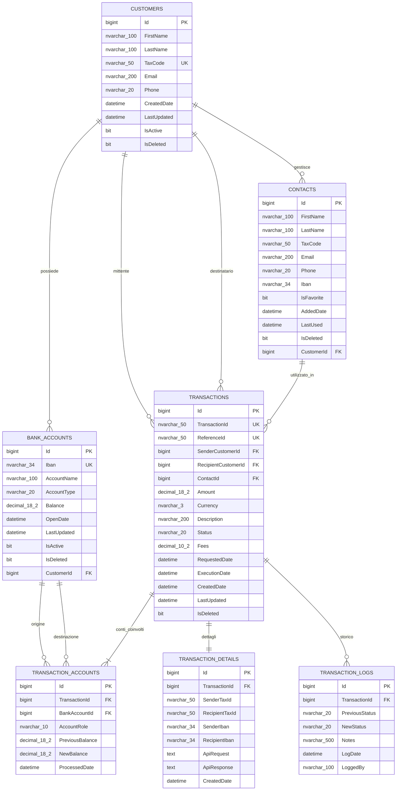

# Database Modification Specification - v1.0

## Metadati del Documento
- **Data Creazione**: 2025-09-15
- **Versione**: 1.0 (creazione iniziale)
- **Stato**: Proposta
- **Autore**: Database Agent
- **Documento Precedente**: N/A (primo documento)

## Analisi del Codice Sorgente

### Entità Identificate dal Backend C#
1. **Customer** (Banking.Models.Entities)
   - Campi: Id, FirstName, LastName, TaxCode (unique), Email, Phone, CreatedDate, IsActive
   - Relazione: 1:N con BankAccount

2. **BankAccount** (Banking.Models.Entities)  
   - Campi: Id, Iban (unique), AccountName, AccountType, Balance, OpenDate, LastUpdated, IsActive, CustomerId
   - Relazione: N:1 con Customer

### Entità Identificate dal Frontend Angular
3. **Contact** (modelli TypeScript)
   - Campi: id, firstName, lastName, taxCode, email, phone, iban, isFavorite, addedDate, lastUsed
   - Attualmente in localStorage - DA CENTRALIZZARE

4. **RecentTransfer** (modelli TypeScript)
   - Campi: id, contactId, contact, amount, description, date, transactionId
   - Attualmente in localStorage - DA CENTRALIZZARE

5. **P2PTransferRequest/Response** (Infrastructure layer)
   - Integrazione con API Banca Alfa per trasferimenti P2P

## Requisiti di Business

### Dalla raccolta interattiva con l'utente:
- **Rubrica centralizzata**: Sincronizzazione cross-device per tutti i clienti
- **Storico completo**: Audit trail completo di tutti i trasferimenti P2P
- **Volumi stimati**: 10.000 clienti prima wave, ~2-5K trasferimenti/giorno
- **Scalabilità**: Sistema progettato per crescita fino a 50K clienti

### Dai documenti di business:
- **Limiti trasferimenti**: €0.01 - €50.000 per singolo trasferimento
- **Gestione preferiti**: Max 10 trasferimenti recenti per cliente
- **Compliance**: Audit trail per PSD2, GDPR compliance
- **Performance**: Risposta API < 5s nel 95% dei casi

## Schema Proposto

### Diagramma delle Relazioni (Mermaid)



### Tabelle

#### CUSTOMERS (evoluzione dell'esistente)
- **Scopo**: Anagrafica clienti con audit trail
- **Modifiche**: Aggiunti LastUpdated, IsDeleted per soft delete
- **Relazioni**: 1:N con BankAccounts, Contacts, Transactions

#### BANK_ACCOUNTS (evoluzione dell'esistente)  
- **Scopo**: Conti bancari clienti con storico saldi
- **Modifiche**: Aggiunto IsDeleted per soft delete
- **Relazioni**: N:1 con Customers, 1:N con TransactionAccounts

#### CONTACTS (NUOVA)
- **Scopo**: Rubrica contatti P2P centralizzata per cliente
- **Colonne principali**: Nome, Cognome, CodFiscale, IBAN, IsFavorite, LastUsed
- **Relazioni**: N:1 con Customers, 1:N con Transactions

#### TRANSACTIONS (NUOVA)
- **Scopo**: Storico completo trasferimenti P2P con stati
- **Colonne principali**: TransactionId, ReferenceId, Amount, Status, Dates
- **Relazioni**: N:1 con Customers (sender/recipient), N:1 con Contacts
- **Stati**: PENDING, VALIDATING, PROCESSING, COMPLETED, FAILED, CANCELLED

#### TRANSACTION_DETAILS (NUOVA)
- **Scopo**: Dettagli tecnici API request/response per audit
- **Colonne principali**: SenderTaxId, RecipientTaxId, ApiRequest, ApiResponse
- **Relazioni**: 1:1 con Transactions

#### TRANSACTION_LOGS (NUOVA)
- **Scopo**: Audit trail cambi di stato transazioni
- **Colonne principali**: PreviousStatus, NewStatus, Notes, LogDate
- **Relazioni**: N:1 con Transactions

#### TRANSACTION_ACCOUNTS (NUOVA)
- **Scopo**: Collegamento transazioni con conti e storico saldi
- **Colonne principali**: AccountRole (SENDER/RECIPIENT), PreviousBalance, NewBalance
- **Relazioni**: N:1 con Transactions e BankAccounts

### Indici Proposti

#### IX_CUSTOMERS_TaxCode
- **Tabella**: CUSTOMERS
- **Colonne**: TaxCode (unique)
- **Motivazione**: Login tramite Tax Code - query più frequente del sistema

#### IX_CUSTOMERS_Email  
- **Tabella**: CUSTOMERS
- **Colonne**: Email
- **Motivazione**: Ricerca clienti per email, notifiche

#### IX_BANK_ACCOUNTS_Iban
- **Tabella**: BANK_ACCOUNTS
- **Colonne**: Iban (unique)
- **Motivazione**: Validazione IBAN in trasferimenti P2P

#### IX_BANK_ACCOUNTS_CustomerId
- **Tabella**: BANK_ACCOUNTS  
- **Colonne**: CustomerId
- **Motivazione**: Caricamento conti per cliente (schermata home)

#### IX_CONTACTS_CustomerId
- **Tabella**: CONTACTS
- **Colonne**: CustomerId
- **Motivazione**: Caricamento rubrica per cliente - operazione molto frequente

#### IX_CONTACTS_CustomerId_IsFavorite
- **Tabella**: CONTACTS
- **Colonne**: CustomerId, IsFavorite
- **Motivazione**: Filtro preferiti nella rubrica P2P

#### IX_CONTACTS_CustomerId_LastUsed
- **Tabella**: CONTACTS
- **Colonne**: CustomerId, LastUsed DESC
- **Motivazione**: Ordinamento contatti recenti (ultimi 10)

#### IX_CONTACTS_TaxCode
- **Tabella**: CONTACTS
- **Colonne**: TaxCode
- **Motivazione**: Ricerca contatti per codice fiscale

#### IX_TRANSACTIONS_TransactionId
- **Tabella**: TRANSACTIONS
- **Colonne**: TransactionId (unique)
- **Motivazione**: Lookup per TransactionId da API Banca Alfa

#### IX_TRANSACTIONS_ReferenceId
- **Tabella**: TRANSACTIONS
- **Colonne**: ReferenceId (unique)
- **Motivazione**: Evitare duplicati per stesso ReferenceId

#### IX_TRANSACTIONS_SenderCustomerId
- **Tabella**: TRANSACTIONS
- **Colonne**: SenderCustomerId, CreatedDate DESC
- **Motivazione**: Cronologia trasferimenti inviati per cliente

#### IX_TRANSACTIONS_RecipientCustomerId  
- **Tabella**: TRANSACTIONS
- **Colonne**: RecipientCustomerId, CreatedDate DESC
- **Motivazione**: Cronologia trasferimenti ricevuti per cliente

#### IX_TRANSACTIONS_Status
- **Tabella**: TRANSACTIONS
- **Colonne**: Status, CreatedDate
- **Motivazione**: Monitoring transazioni per stato (pending, failed)

#### IX_TRANSACTIONS_ExecutionDate
- **Tabella**: TRANSACTIONS
- **Colonne**: ExecutionDate DESC
- **Motivazione**: Report e analytics temporali

#### IX_TRANSACTION_LOGS_TransactionId
- **Tabella**: TRANSACTION_LOGS
- **Colonne**: TransactionId, LogDate DESC
- **Motivazione**: Audit trail per singola transazione

### Sequence

#### seq_Customers
- **Utilizzo**: Generazione ID per nuovi clienti
- **Configurazione**: Start 1000, Increment 1

#### seq_BankAccounts
- **Utilizzo**: Generazione ID per nuovi conti bancari  
- **Configurazione**: Start 1000, Increment 1

#### seq_Contacts
- **Utilizzo**: Generazione ID per contatti rubrica
- **Configurazione**: Start 1, Increment 1

#### seq_Transactions
- **Utilizzo**: Generazione ID per trasferimenti P2P
- **Configurazione**: Start 1, Increment 1

### Stored Procedures

#### sp_GetCustomerByTaxCode
- **Scopo**: Login - recupero cliente per Tax Code con conti associati
- **Parametri**: @TaxCode NVARCHAR(50)
- **Suggerimento integrazione**: Utilizzare in CustomersController.GetByTaxCode()

#### sp_GetCustomerBankAccounts
- **Scopo**: Caricamento conti bancari per cliente (schermata home)
- **Parametri**: @CustomerId BIGINT
- **Suggerimento integrazione**: BankAccountsController.GetByCustomerId()

#### sp_GetCustomerContacts
- **Scopo**: Caricamento rubrica completa per cliente
- **Parametri**: @CustomerId BIGINT, @IsFavorite BIT = NULL
- **Suggerimento integrazione**: Nuovo ContactsController.GetByCustomerId()

#### sp_GetRecentContacts
- **Scopo**: Ultimi 10 contatti utilizzati ordinati per LastUsed DESC
- **Parametri**: @CustomerId BIGINT, @Limit INT = 10
- **Suggerimento integrazione**: ContactsController.GetRecent()

#### sp_CreateOrUpdateContact
- **Scopo**: Inserimento/aggiornamento contatto rubrica
- **Parametri**: @CustomerId, @FirstName, @LastName, @TaxCode, @Email, @Phone, @Iban, @IsFavorite
- **Suggerimento integrazione**: ContactsController.CreateOrUpdate()

#### sp_CreateTransaction
- **Scopo**: Creazione nuova transazione P2P con stato PENDING
- **Parametri**: @SenderCustomerId, @RecipientTaxCode, @ContactId, @Amount, @Currency, @Description, @ReferenceId
- **Suggerimento integrazione**: P2PController.Transfer() - prima della chiamata API

#### sp_UpdateTransactionStatus
- **Scopo**: Aggiornamento stato transazione con audit log
- **Parametri**: @TransactionId, @NewStatus, @Notes, @TransactionIdBancaAlfa = NULL
- **Suggerimento integrazione**: P2PController - dopo risposta API Banca Alfa

#### sp_GetTransactionHistory
- **Scopo**: Cronologia transazioni per cliente con paginazione
- **Parametri**: @CustomerId BIGINT, @PageNumber INT = 1, @PageSize INT = 50
- **Suggerimento integrazione**: Nuovo TransactionsController.GetHistory()

#### sp_GetTransactionDetails
- **Scopo**: Dettaglio completo transazione con API request/response
- **Parametri**: @TransactionId BIGINT
- **Suggerimento integrazione**: TransactionsController.GetDetails() per supporto

#### sp_UpdateContactLastUsed
- **Scopo**: Aggiornamento LastUsed dopo completamento trasferimento
- **Parametri**: @ContactId BIGINT
- **Suggerimento integrazione**: P2PController - dopo successo trasferimento

#### sp_GetDashboardStats
- **Scopo**: Statistiche per dashboard amministrativa
- **Parametri**: @DateFrom DATETIME = NULL, @DateTo DATETIME = NULL
- **Suggerimento integrazione**: Nuovo AdminController per monitoring

## Suggerimenti per l'Integrazione

### 1. Modifiche al Backend C#

#### Nuove Entità da creare:
```csharp
// Banking.Models/Entities/Contact.cs
public class Contact
{
    public long Id { get; set; }
    public string FirstName { get; set; }
    public string LastName { get; set; }
    public string TaxCode { get; set; }
    public string? Email { get; set; }
    public string? Phone { get; set; }
    public string? Iban { get; set; }
    public bool IsFavorite { get; set; }
    public DateTime AddedDate { get; set; }
    public DateTime? LastUsed { get; set; }
    public bool IsDeleted { get; set; }
    public long CustomerId { get; set; }
    public virtual Customer Customer { get; set; }
    public virtual ICollection<Transaction> Transactions { get; set; }
}

// Banking.Models/Entities/Transaction.cs  
public class Transaction
{
    public long Id { get; set; }
    public string TransactionId { get; set; } // Da Banca Alfa
    public string? ReferenceId { get; set; }
    public long SenderCustomerId { get; set; }
    public long? RecipientCustomerId { get; set; }
    public long? ContactId { get; set; }
    public decimal Amount { get; set; }
    public string Currency { get; set; } = "EUR";
    public string? Description { get; set; }
    public TransactionStatus Status { get; set; }
    public decimal Fees { get; set; }
    public DateTime RequestedDate { get; set; }
    public DateTime? ExecutionDate { get; set; }
    public DateTime CreatedDate { get; set; }
    public DateTime LastUpdated { get; set; }
    public bool IsDeleted { get; set; }
    
    // Navigation properties
    public virtual Customer SenderCustomer { get; set; }
    public virtual Customer? RecipientCustomer { get; set; }
    public virtual Contact? Contact { get; set; }
    public virtual TransactionDetail? TransactionDetail { get; set; }
    public virtual ICollection<TransactionLog> TransactionLogs { get; set; }
    public virtual ICollection<TransactionAccount> TransactionAccounts { get; set; }
}

public enum TransactionStatus
{
    PENDING,
    VALIDATING, 
    PROCESSING,
    COMPLETED,
    FAILED,
    CANCELLED
}
```

#### Aggiornamenti BankingDbContext:
```csharp
public DbSet<Contact> Contacts { get; set; }
public DbSet<Transaction> Transactions { get; set; }
public DbSet<TransactionDetail> TransactionDetails { get; set; }
public DbSet<TransactionLog> TransactionLogs { get; set; }
public DbSet<TransactionAccount> TransactionAccounts { get; set; }
```

#### Nuovi Controller suggeriti:
- **ContactsController**: Gestione rubrica centralizzata
- **TransactionsController**: Cronologia e dettagli trasferimenti
- **AdminController**: Dashboard e monitoring

### 2. Modifiche al Frontend Angular

#### Sostituzione localStorage con API calls:
```typescript
// services/contacts.service.ts
@Injectable()
export class ContactsService {
  getContacts(): Observable<Contact[]> {
    return this.http.get<Contact[]>(`${this.apiUrl}/contacts`);
  }
  
  getFavoriteContacts(): Observable<Contact[]> {
    return this.http.get<Contact[]>(`${this.apiUrl}/contacts/favorites`);
  }
  
  getRecentContacts(): Observable<Contact[]> {
    return this.http.get<Contact[]>(`${this.apiUrl}/contacts/recent`);
  }
}

// services/transactions.service.ts  
@Injectable()
export class TransactionsService {
  getTransactionHistory(): Observable<Transaction[]> {
    return this.http.get<Transaction[]>(`${this.apiUrl}/transactions/history`);
  }
}
```

### 3. Configurazione Entity Framework

#### Connection String per SQL Server:
```json
{
  "ConnectionStrings": {
    "DefaultConnection": "Server=localhost,1433;Database=BankingDB;User Id=sa;Password=YourPassword123!;TrustServerCertificate=true;"
  }
}
```

#### Program.cs registration:
```csharp
builder.Services.AddDbContext<BankingDbContext>(options =>
    options.UseSqlServer(builder.Configuration.GetConnectionString("DefaultConnection")));
```

## Status
- [x] Proposta creata
- [x] Approvata dall'utente
- [x] Modifiche implementate

## Log delle Modifiche
### Versione 1.0 - 2025-09-15
- **Tipo**: Creazione Iniziale
- **Descrizione**: Schema completo per sistema bancario FSI con rubrica centralizzata e audit trail completo
- **Status Implementazione**: 
  - [x] SQL generato
  - [x] Approvato dall'utente  
  - [x] Eseguito sul database
  - [x] Verificato funzionamento
  
**Modifica effettuata sul database in data: 2025-09-15**

### Dettagli Implementazione:
- **Database**: `database-demo-2025`
- **Schema**: `digitalbank` (non dbo)
- **Tabelle create**: 7 (Customers, BankAccounts, Contacts, Transactions, TransactionDetails, TransactionLogs, TransactionAccounts)
- **Indici creati**: 15 indici ottimizzati
- **Stored Procedures**: 11 procedures operative
- **Sequence**: 4 sequence per generazione ID
- **Dati demo**: Clienti, conti, contatti e transazioni di esempio inseriti
- **Test eseguiti**: ✅ Login, ✅ Rubrica, ✅ Cronologia, ✅ Dashboard

### Storia Precedente
N/A - Prima versione del documento

<!-- Sezione aggiornata automaticamente dall'agente -->